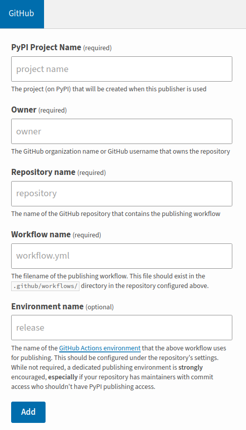

=================
Quick-start Guide
=================

Installation
^^^^^^^^^^^^

.. card:: :octicon:`terminal;2em;sd-text-info`

    ```bash
    pip install OZI
    ```

Usage
^^^^^

Choose a CI Provider
********************

Currently the available CI Providers are:

* GitHub

It is recommended that you create an empty project and clone into a local repo folder using
an IDE of your choice. You should also create a PyPI account and
`add a new pending publisher <https://pypi.org/manage/account/publishing/>` using:



    Screenshot of PyPI New pending publisher form taken 17-Sep-2023.

* PyPI Project Name: PROJECT_NAME
* Owner: GH_USER
* Repository name: GH_PROJECT_NAME
* Workflow name: ozi.yml
* Environment name: publish

It is recommended to enable 2 Factor Authentication on both your CI provider and PyPI 
account.

New Project
***********

Navigate to the cloned repository locally with the terminal emulator of your choice.

.. card:: :octicon:`terminal;2em;sd-text-info`

    ```bash
    ozi-new project --name=PROJECT_NAME --author=AUTHOR --email=EMAIL --summary=SUMMARY \
        --homepage=HOMEPAGE --license-expression SPDX-EXPR --license LICENSE \
        TARGET
    ```

This will create a project with ``Development Status :: 1 - Planning``,
``Topic :: Utilities``, ``Typing :: Typed``, and ``Natural Language :: English``.
You can also change these defaults by providing parameters to their respective arguments.

Find Missing Files
******************

.. card:: :octicon:`terminal;2em;sd-text-info`

    ```bash
    ozi-fix -m TARGET
    ```

.. card:: :octicon:`ellipsis;2em;sd-text-info`

    ```
    ok 1 - Parse PKG-INFO
    ok 2 - Metadata-Version: 2.1
    ok 3 - Name: PROJECT_NAME
    ok 4 - Version: {version}
    ok 5 - Summary: short summary
    ok 6 - Classifier: Development Status :: 1 - Planning
    ok 7 - Classifier: Intended Audience :: Other Audience
    ok 8 - Classifier: License :: LICENSE
    ok 9 - Classifier: Natural Language :: English
    ok 10 - Classifier: Programming Language :: Python :: 3
    ok 11 - Classifier: Programming Language :: Python :: 3.10
    ok 12 - Classifier: Programming Language :: Python :: 3.11
    ok 13 - Classifier: Programming Language :: Python :: 3.9
    ok 14 - Classifier: Programming Language :: Python :: Implementation :: CPython
    ok 15 - Classifier: Topic :: Utilities
    ok 16 - Classifier: Typing :: Typed
    ok 17 - Classifier: Environment :: Other Environment
    ok 18 - Project-URL: Homepage, HOMEPAGE
    ok 19 - Description-Content-Type: text/x-rst
    ok 20 - Classifier: License-Expression :: SPDX-EXPR
    ok 21 - Classifier: License-File :: LICENSE.txt
    ok 22 - README.rst
    ok 23 - .gitignore
    ok 24 - pyproject.toml
    ok 25 - meson.build
    ok 26 - meson.options
    ok 27 - LICENSE.txt
    ok 28 - PKG-INFO
    ok 29 - PROJECT_NAME/meson.build
    ok 30 - PROJECT_NAME/__init__.py
    ok 31 - PROJECT_NAME/py.typed
    ok 32 - tests/meson.build
    1..32
    ```

Create New Sources
^^^^^^^^^^^^^^^^^^

.. card:: :octicon:`terminal;2em;sd-text-info`

    ```bash
    ozi-new source NAME.py --author=AUTHOR
    ```

Add Created Sources
^^^^^^^^^^^^^^^^^^^

.. card:: :octicon:`terminal;2em;sd-text-info`

    ```bash
    ozi-fix --add PROJECT_NAME/NAME.py . | meson rewrite command
    ```

